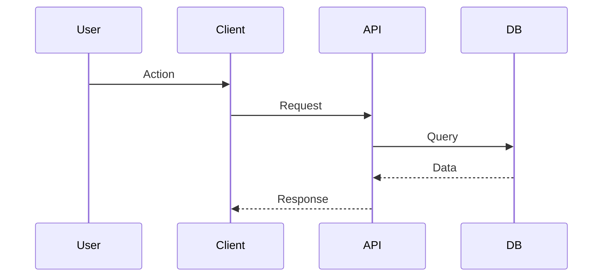

# [Flow Name] (e.g., Checkout Flow)

## Trigger
**What starts this flow?**
-   User action: [Click Button X]
-   System event: [Cron Job / Webhook]

## High-Level Sequence

## Logic Trace (Step-by-Step)
*Detailed breakdown of the internal decision tree.*

1.  **Validation**:
    -   Check if [Condition A] is true.
    -   IF False -> Return Error [Code].
2.  **Processing**:
    -   Calculate [X] using formula [Y].
    -   Call external service [Z].
3.  **State Update**:
    -   Update database table [Table Name], set status to [Status].

## Data Transformations
-   Input: `JSON { field: "value" }`
-   Output: `Object { field: "formatted_value" }`

## Related Files
-   [Controller File](./path/to/file)
-   [Service File](./path/to/file)
